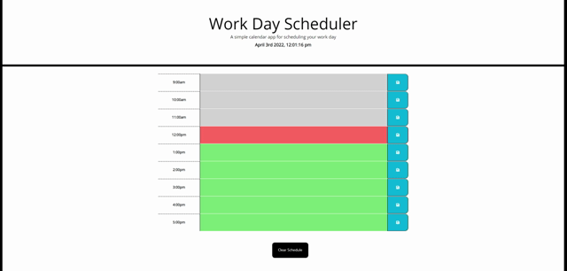

# Work Day Scheduler

### Created by Carolyn Hudson

---

## Description:
This application allows users to create a schedule using the daily planner. The current date and time is displayed at the top of the page. The user is presented with timeblocks for standard business hours that are color-coded to indicate whether it is in the past, present, or future. The user can enter event details into the text area and save to local storage using the save button. The saved events persist when the page is refreshed. 

---

## Preview:
The following GIF demonstrates the web application's appearance and functionality:

---

## Links:

* GitHub [Repository](https://github.com/cghudson/work-day-scheduler)

* Deployed application [URL](https://cghudson.github.io/work-day-scheduler/) 